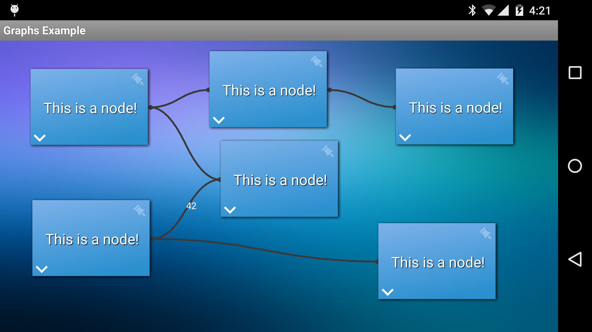
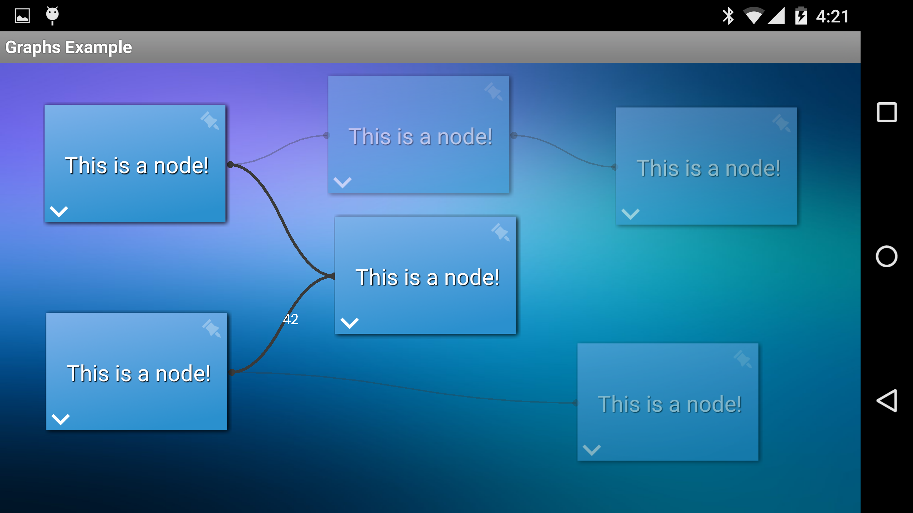
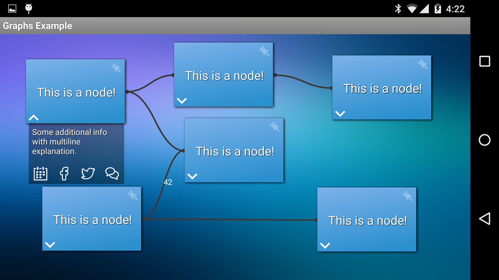

# Graphs

A simple graph visualization library and an exampe application for Android.

### See Graphs in action

[video](https://www.youtube.com/watch?v=3rE-w2Fk8Lc)

### Example application

[Download the apk file from here](graphsExample-1.0.apk "APK 1.0")

### Screens




### Usage

You can simply create a new NodePresenter and ConnectionDrawer class, like this:

```java
public class ExampleNodeView extends RelativeLayout implements NodePresenter {
  public void setNode(Node node) {
    //...
  }

  public float getNodeWidth() {
    //...
  }
  
  public float getNodeHeight() {
    //...
  }

  public void setPosition(float x, float y) {
    //...
  }

  public void setHighlighted(boolean selected)  {
    //...
  }
  
  public boolean isHighlighted() {
    //...
  }

  public void onDragStarted()  {
    //...
  }
  
  public void onDragEnded() {
    //...
  }
}

public class ExampleConnectionDrawer implements ConnectionDrawer {

  @Override
  public void drawConnection(Canvas canvas, Connection connection) {
    /*
      Here you can use the following methods to draw the connection:
      connection.getFromNode();
      connection.getToNode();
      connection.getColor();
      connection.isDirected();
      connection.getLabel();
    */
  }
}
```

Once you created the necessary classes you can set up a Graph to use it. Something like this:

```java
  //...
  GraphView graphView = (GraphView) findViewById(R.id.graph);

  Graph graph = new Graph();
  Node n1 = graph.createNewNode(new ExampleNodeView(this));
  //Closer to 0 --> heavier, closer to 1 --> lighter. (It has to be between 0-1)
  n1.setWeight(0.9f);
  //The position on the screen
  n1.setPosition(p.x, p.y);

  Node n2 = graph.createNewNode(new ExampleNodeView(this));
  n2.setWeight(0.5f);

  Node n3 = graph.createNewNode(new ExampleNodeView(this));
  n3.setWeight(0.96f);

  Node n4 = graph.createNewNode(new ExampleNodeView(this));
  n4.setWeight(0.9f);
  n4.setPosition(p.x, p.y);

  Node n5 = graph.createNewNode(new ExampleNodeView(this));
  n5.setWeight(0.5f);
  
  Node n6 = graph.createNewNode(new ExampleNodeView(this));
  n6.setFixed(true);
  n6.setWeight(0.96f);
  n6.setPosition(500, 500);

  graph.createNewConnection(n1, n5).setLabel("42");
  graph.createNewConnection(n2, n3);
  graph.createNewConnection(n3, n4);
  graph.createNewConnection(n2, n5);
  graph.createNewConnection(n1, n6);

  graphView.setGraph(graph, new ExampleConnectionDrawer());
```

And don't forget to add a GraphView to the layout:

```java
  <hu.gabornovak.graphs.view.GraphView
      android:id="@+id/graph"
      android:layout_width="match_parent"
      android:layout_height="match_parent" />
```

Aaaaand that's it. You are ready to go.

For more information please check out the example app or ask me.
